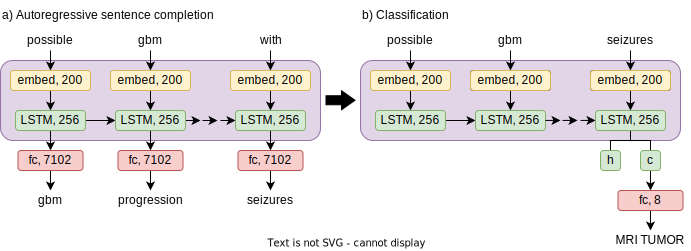

# AI-Assisted Brain MRI Protocolling

This repository accompanies a paper currently under review[^1].

The goal was to use text information associated with brain MRI exams (order diagnoses, reason for the exam, order comments) to predict the most appropriate protocol. This was accomplished using an LSTM[^2] model and pre-trained BioWordVec[^3] embeddings.

The model was trained in two steps:

1. Pre-training the model as a language model (autoregressive sentence completion task)

2. Fine-tuning the model as a classification model (assigning one out of 8 possible labels)

***



**Figure 1.** Overview of the network architectures using "possible gbm progression presenting with seizures" as text input.

## Set up environment

```bash
conda create -n <environment-name> python=3.8
conda env update --name <environment-name> --file environment.yml
```
## Supporting files

- `utils.py` - functions for loading and preparing datasets, saving and loading models, training models
- `metrics.py` - functions for evaluating models
- `model/lstm_lm.py` - model for language model
- `model/lstm_clas.py` - model for classification

## Configuration file

`config.json` specifies hyperparameter values and file paths used by the program. The user should modify these values as necessary to accomodate their projects. It should contain the following fields:

- `lm_epochs`: integer, number of epochs used for training the language model
- `clas_epochs`: integer, number of epochs used for training the classification model
- `batch_size`: integer, batch size used during training and evaluation
- `hidden_size`: integer, hidden size of the bi-directional LSTM within the models
- `num_layers`: integer, number of layers in the bi-directional LSTM within the models
- `dropout`: float, proportion of values dropped on average at the dropout layer during training
- `learning_rate`: float, learning rate used at each step size during training
- `biowordvec_path`: string, path to BioWordVec embeddings. See [bio_embedding_extrinsic](#bio_embedding_extrinsic) for more details.
- `out_of_vocab_path`: string (*optional*, `null` if not provided), path to file containing out-of-vocabulary replacement rules. See [misspellings.txt](#misspellingstxt) for more details.
- `train_data_path`: string, path to CSV file containing training/validation data. See [train-valid-data.csv](#train-valid-datacsv) for more details.
- `test_data_path`: string, path to CSV file containing test data. See [test-data.csv](#test-datacsv) for more details.
- `lm_weights_path`: string, save location of language model weights
- `clas_weights_path`: string, save location of classification model weights

## Data files

These files must be provided by the user:

- `data/bio_embedding_extrinsic` - pre-trained word embeddings for extrinsic tasks
- `data/misspellings.txt` - replacement rules for out-of-vocabulary terms
- `data/train-valid-data.csv` - data for training and validation sets
- `data/test-data.csv` - data for test set

### bio_embedding_extrinsic

Pre-trained BioWordVec[^3] word embeddings can be found at https://github.com/ncbi-nlp/BioWordVec.

### misspellings.txt

Note: this file is *optional*. To avoid applying replacement rules for out-of-vocabulary tokens, specify `null` for the `out_of_vocab_path` field of `config.json`.

The first two lines of the file are reserved for metadata. The number of lines designated for metadata can be changed in the `load_misspelled` function in `utils.py`.

These lines are followed by misspelling replacement rules, which take the form:

```
count misspelled-token -> [replacement-token]* replacement-choice
```

`count` is the number of occurrences of the "misspelled" token in the dataset. *Optional*, but should have some non-whitespace term to work with the code as is.

`misspelled-token` is the "misspelled" token, i.e., it is not found in the BioWordVec vocabulary.

`replacement-token` is a similar or corresponding token in the BioWordVec vocabulary (computed using Levenshtein distance for this paper). There can be any number of these separated by spaces.

`replacement-choice` is either a number starting at `1` indicating the `replacement-token` with which to replace `misspelled-token`, or `#`, which specifies replacing `misspelled-token` with nothing.

An example of this file is provided at `data/misspellings.txt`.

### train-valid-data.csv

This file should contain the following columns (column names can be different, but order should be the same):

- `ID` - unique number assigned to this exam
- `label` - number indicating originally assigned protocol
- `text` - text information associated with this exam

### test-data.csv

This file should contain the following columns (column names can be different, but order should be the same):

- `ID` - unique number assigned to this exam
- `reviewer1` - number indicating protocol chosen by the first reviewer
- `reviewer2` - number indicating protocol chosen by the second reviewer
- `label` - number indicating originally assigned protocol
- `truth` - number indicating protocol decided by physician consensus
- `text` - text information associated with this exam

## Usage

Use the following scripts to train and evaluate the model:

- `train_lm.py` - Train language model and save weights:

	```bash
	python train_lm.py config.json
	```

- `train_clas.py` - Load weights from language model, train classifier, and save weights:

	```bash
	python train_clas.py config.json
	```

- `evaluate_clas.py` - Evaluate classifier on test set labeled with originally assigned protocols, on test set labeled with protocols decided by physician consensus, and as a clinical decision support tool (can specify the tested thresholds and number of suggested protocols by modifying `thresh_list` and `k_list` within this file):

	```bash
	python evaluate_clas.py config.json
	```

- `run_clas.py` - Run classifier on an input string:

	```bash
	python run_clas.py config.json "This is a test string"
	```


## References

[^1]: Wong KA, Hatef A, Ryu JL, Nguyen XV, Makary MS, Prevedello LM. An Artificial Intelligence Tool for Clinical Decision Support and Protocol Selection for Brain MRI. 2022.
[^2]: Hochreiter S, Schmidhuber J. Long Short-Term Memory. *Neural Computation*. 1997;9(8):1735-1780. doi:10.1162/neco.1997.9.8.1735
[^3]: Zhang Y, Chen Q, Yang Z, Lin H, Lu Z. [BioWordVec, improving biomedical word embeddings with subword information and MeSH](https://www.nature.com/articles/s41597-019-0055-0). *Scientific Data*. 2019;6(1):52. doi:10.1038/s41597-019-0055-0
